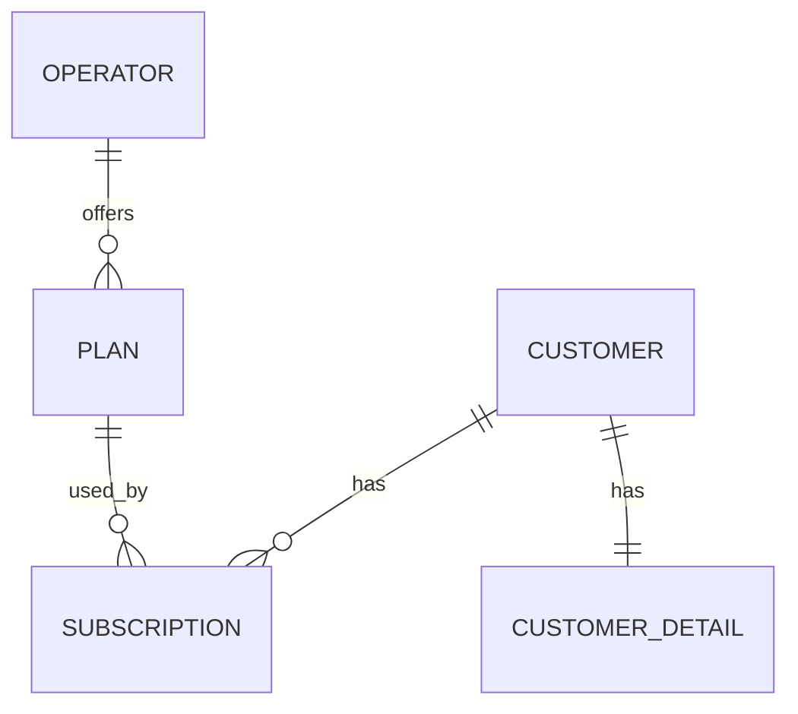

# ProjectTest – Subscription Platform

**Project Type:** Backend REST API (Spring Boot + JPA)

## Overview

You will extend and complete an existing backend project for a **Subscription Management Platform**.  
The system allows service providers to offer subscription plans, while customers can browse plans and manage their
subscriptions.

Your implementation must follow the functional and technical requirements described below.

---

## Scenario

You are building a backend for a **subscription management platform** used by multiple service providers (**operators**).

Operators offer subscription plans in two categories:

### Internet Services

- Fiber 50
- Fiber 100
- Fiber 300

### Mobile Services

- Mobile Basic
- Mobile Plus
- Mobile Unlimited

Each operator maintains its own catalog of plans.

Each plan contains:

- Name
- Price
- Service type (Internet or Mobile)
- Optional data limit
- Active/Inactive status

Customers can:

- Register and manage their profile
- Browse operators and active plans
- Subscribe to plans
- Change plans
- Cancel subscriptions

---

## Business Rules

- A customer may have **at most one active subscription per service type**:
    - One Internet subscription
    - One Mobile subscription

- A subscription is created with status **ACTIVE**
- Cancelled subscriptions must store a cancellation date
- Only **active plans** are visible and subscribable
- Plan changes are allowed **only within the same operator and same service type**

Violations of these rules must result in meaningful custom exceptions.

---

## Actors

| Actor        | Responsibilities                          |
|--------------|-------------------------------------------|
| **Admin**    | Create and manage operators and plans     |
| **Customer** | Browse plans and manage own subscriptions |

---

### Domain Analysis


## Entity Requirements

- Define JPA relationships and ownership
- Add required fields to `Plan` and `Subscription`
- Use enums where applicable (service type, subscription status)
- Enable auditing (`createdAt`, `updatedAt`)
- Add constraints (unique, not null, length, etc.)

---

## Service Layer

- Implement services for all domain operations
- Use `@Transactional` on write operations
- Enforce business rules inside services
- Throw custom exceptions for invalid operations

---

## DTOs, Mapping & Validation

- Use DTOs (records recommended)
- Do **not** expose entities in controllers
- Use validation annotations (`@NotNull`, `@NotBlank`, etc.)
- Convert between Entity and DTO using MapStruct or manual mappers

---

## REST API & Security

- Controllers for **Plan** and **Subscription**
- Role-based access:
  - ADMIN → manage operators & plans
  - CUSTOMER → manage own subscriptions
- Return correct HTTP status codes
- Global exception handling
- (Optional) Swagger annotations

### Required API Functionality

Expose endpoints that support the following operations.

#### Plan API

**ADMIN must be able to:**
- Create a plan
- Update a plan
- Delete a plan
- View all plans (active and inactive)

**CUSTOMER must be able to:**
- View all active plans
- View active plans by service type (Internet / Mobile)
- View plans belonging to a specific operator

---

#### Subscription API

**CUSTOMER must be able to:**
- Subscribe to a plan
- View their own subscriptions
- Change subscription plan
- Cancel subscription

The API must enforce the business rules defined in this document (for example: one active subscription per service type).

---


## Seed Data

Initialize:

- At least 2 operators
- Multiple plans per operator
- Both active and inactive plans

---

## (Optional) Testing

- Unit tests for repositories
- Unit tests for services
- Controller tests

---

## ✅ Submission Checklist

- GitHub repository link
- `pom.xml` contains required dependencies
- Entities and relationships implemented
- Services, transactions, and exceptions
- DTOs and validation
- Swagger UI accessible
- README with run instructions
- Seed data included

---

## Technical Stack & Requirements

### Technologies Used

* **Java 25**
* **Spring Boot 4.x**
* **Spring Data JPA** (Hibernate)
* **Spring Security** (JWT Authentication)
* **MySQL 8.0** (Database)
* **Redis** (Token Blacklisting)
* **MapStruct** (Object Mapping)
* **Lombok** (Boilerplate reduction)
* **Swagger/OpenAPI 3** (API Documentation)
* **Maven** (Build Tool)
* **Docker & Docker Compose** (Infrastructure)

### Prerequisites

Before running the application, ensure you have the following installed:

* [JDK 25](https://www.oracle.com/java/technologies/downloads/)
* [Maven](https://maven.apache.org/download.cgi)
* [Docker Desktop](https://www.docker.com/products/docker-desktop/)

---

## Getting Started

### 1. Infrastructure Setup (Database & Redis)

The project uses Docker Compose to manage the MySQL database and Redis server.

Run the following command in the project root:

```bash
docker-compose up -d
```

* **MySQL:** Port `3307`
* **Redis:** Port `6379`

### 2. Run the Application

Navigate to the `subscription-api` directory and run:

```bash
mvn spring-boot:run
```

### 3. API Documentation

Once the app is running, access the Swagger UI at:
`http://localhost:8080/swagger-ui.html`

